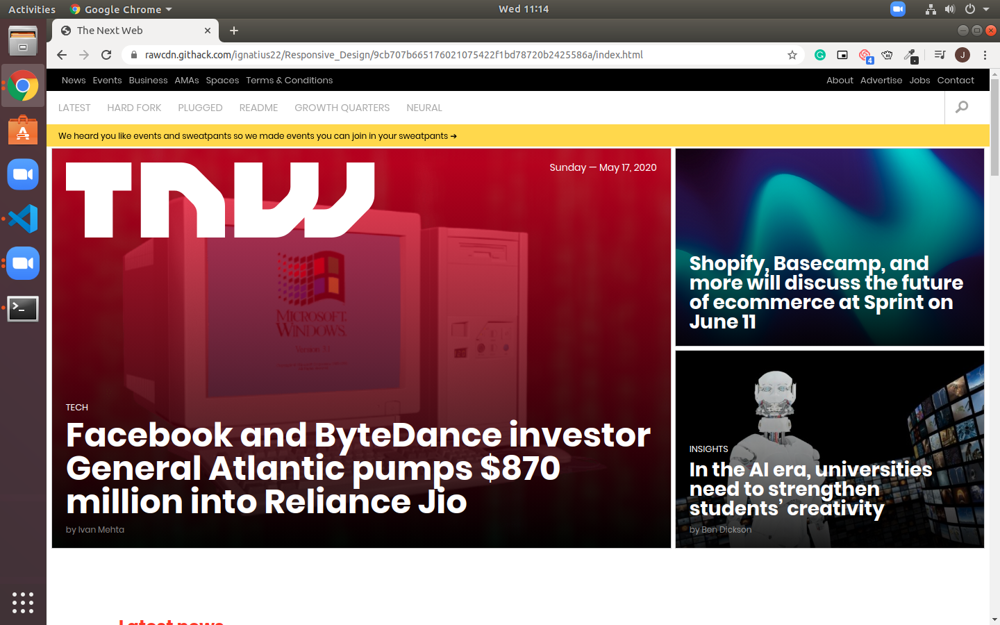

# Responsive Design

> A clone of The Next Web website.

This page is a basic clone of The Next Web, this project has been an exercise of using media queries in CSS. the main purpose of this project has been to build responsive design and to aquire further practice on using CSS Flex and CSS Grid. 

## Built With

- HTML
- SCSS

## Live Demo

Live link: https://rawcdn.githack.com/ignatius22/Responsive_Design/aa1c902520fb3650a044f7719dcea14af01290a1/index.html

## Authors

👤 **Author1**
Ignatius Sani:
- Github: https://github.com/ignatius22 
- Linkedin: https://www.linkedin.com/in/ignatius-sani-982b8b186/  

👤 **Author2**
Jacob Rees:
- Github: https://github.com/jacobrees
- Linkedin: https://www.linkedin.com/in/jacob-rees-a6507b1a6/

